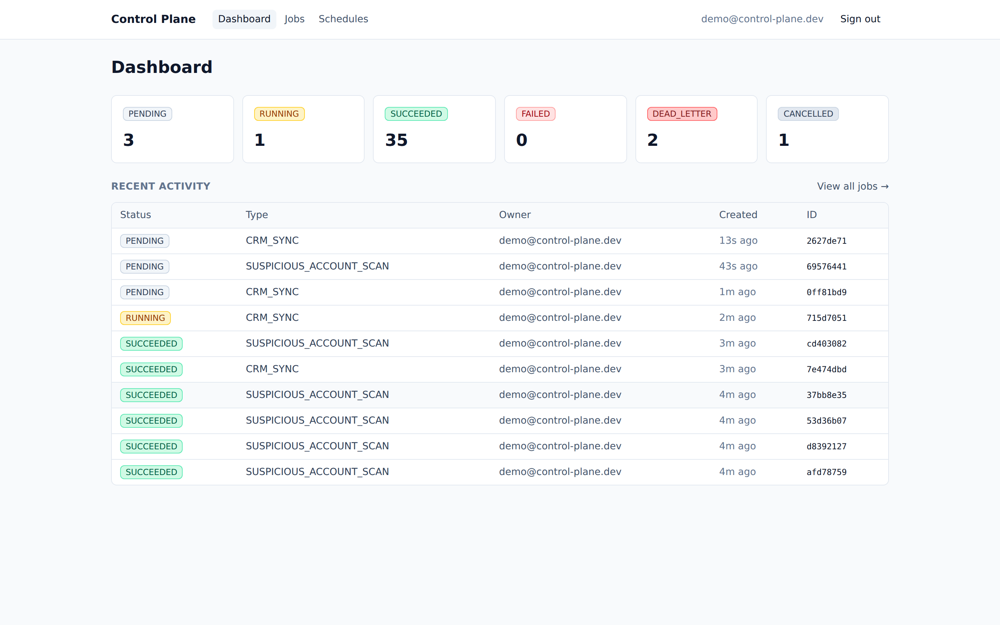
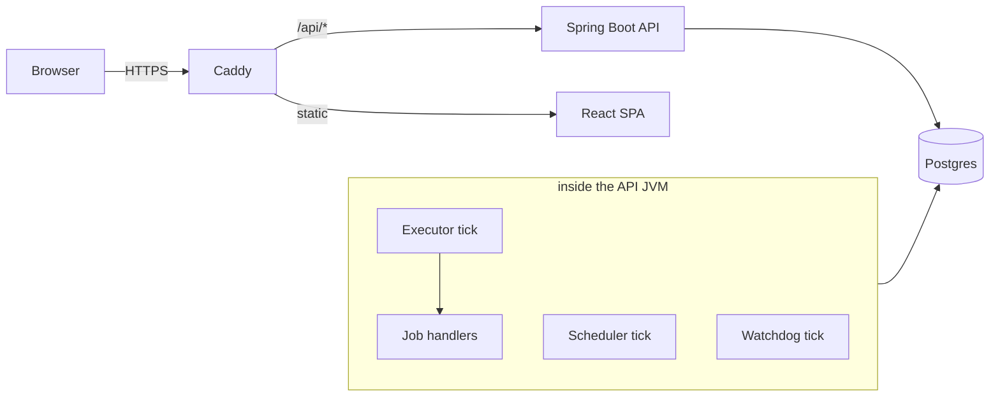
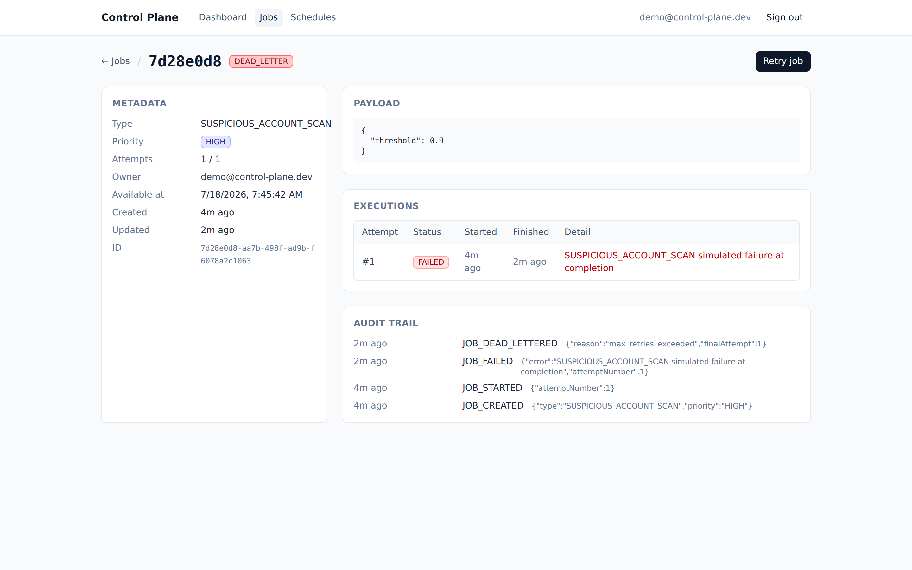
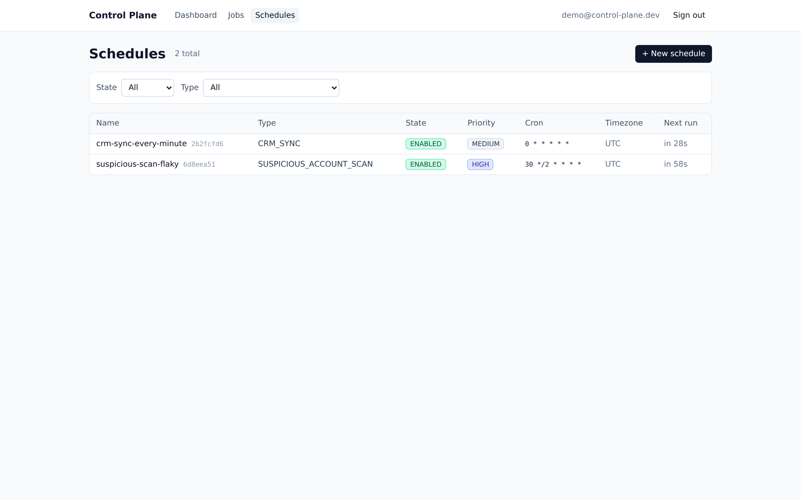

# Control Plane

[](https://github.com/walker-systems/control-plane/actions/workflows/ci.yml)
[](https://github.com/walker-systems/control-plane/actions/workflows/deploy.yml)
[](https://control-plane.dev)

A distributed job orchestration platform: Postgres-backed job queue with
priorities, retries, cron schedules, lease-based crash recovery, and a
live operations UI.

**Live demo: [control-plane.dev](https://control-plane.dev)** — deployed
automatically on every merge to `main`.



## How it works

Spring Boot 4 / Java 25 (virtual threads) + React 19 / TypeScript.
Postgres is both the system of record and the queue: jobs are claimed
with `FOR UPDATE SKIP LOCKED`, so any number of executors can pull from
the same table without coordination, and crash recovery is a watchdog
reclaiming expired leases — no broker, no heartbeat protocol.



Every attempt records an execution row with a lease; failures retry
with backoff until they dead-letter, and every transition lands in an
audit trail:



<details>
<summary>Cron schedules — pause/resume, timezone-aware, materialized into jobs</summary>


</details>

## Run it locally

One command — pulls published images, no JDK or Node required:

```bash
docker compose -f deploy/compose.demo.yml up -d
```

Open **http://localhost:8000** and log in as `demo@control-plane.dev` /
`demo-password`. Then give the dashboard something to show:

```bash
./scripts/seed-demo.sh
```

That creates two cron schedules (one healthy, one deliberately flaky so
dead-letter and retry flows have something to act on) and a burst of
one-off jobs. Jobs run with simulated handlers that take 6–16s,
occasionally fail, and rarely dead-letter.

Tear down with `docker compose -f deploy/compose.demo.yml down -v`.

## What to look at

| | |
|---|---|
| Job lifecycle | PENDING → RUNNING → SUCCEEDED / FAILED (retry with backoff) → DEAD_LETTER |
| Cancel semantics | PENDING cancels instantly; RUNNING defers until the in-flight attempt completes |
| Schedules | 6-field cron + timezone, pause/resume, jobs link back to their schedule |
| Concurrency | `SKIP LOCKED` claims, exec-then-job lock ordering, lease watchdog |
| Auditing | Every state transition recorded; audit trail visible to OPERATOR/ADMIN |

## Repository layout

```
services/api   Spring Boot API + job executor (see docs/architecture.md)
services/ui    React SPA (Vite, TanStack Query, Tailwind)
deploy/        Production compose stack, Caddyfile, local demo compose
docs/          Architecture, API reference, ADRs, deployment runbook
```

## Docs

- [Architecture](docs/architecture.md) — queue design, lifecycle, leases, the three ticks
- [API reference](docs/api.md)
- [Deployment](docs/deployment.md) — droplet + Caddy + GitHub Actions CD
- [Roadmap](docs/roadmap.md)
- [ADR-0001: in-process job executor](docs/adr/0001-in-process-job-executor.md)
