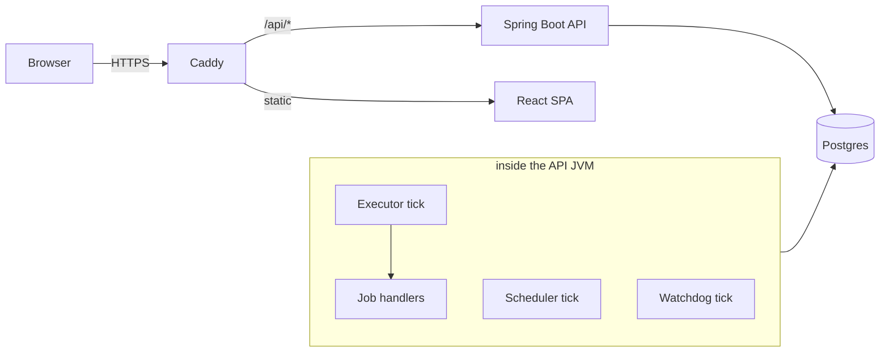
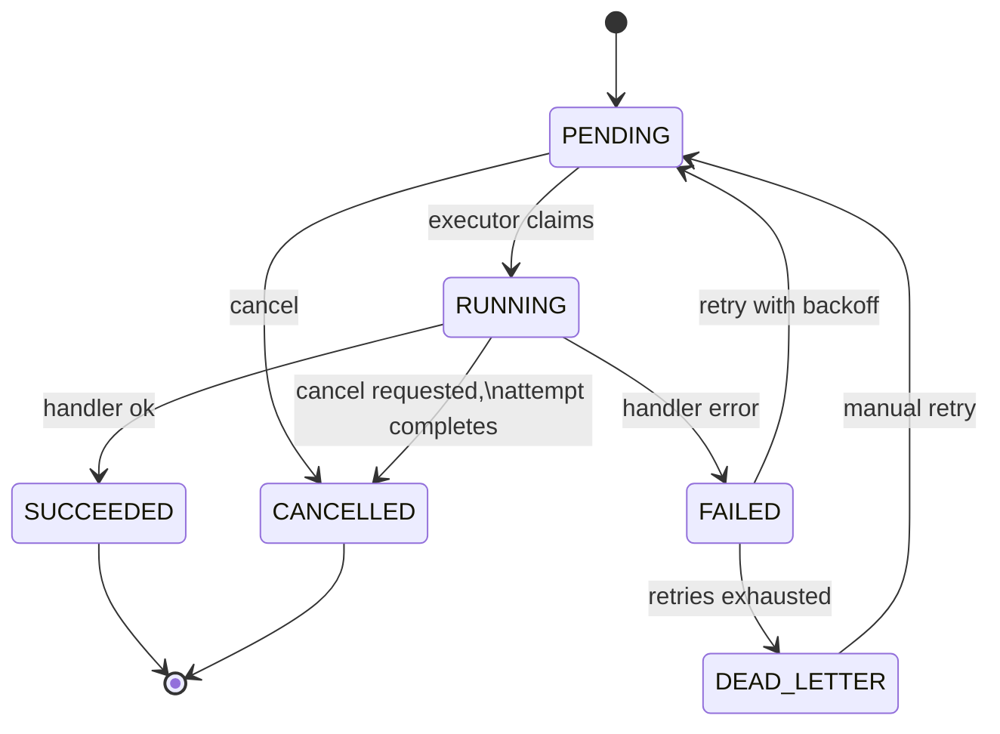

# Architecture

Control Plane is deliberately a **two-deployable system**: one Spring
Boot service and one static React bundle. There is no separate worker
fleet and no message broker in the job path — Postgres is both the
system of record and the queue.

## Postgres as the queue

Jobs are rows. A claim is `SELECT … FOR UPDATE SKIP LOCKED` ordered by
priority and age: any number of executor instances can pull from the
same table concurrently without coordination, because a locked row is
simply skipped by every other claimer. This trades peak throughput for
operational simplicity — one database, transactional everything, no
dual-write between a broker and the DB.

Two subtleties the code works around:

- **Follow-on locking.** Hibernate can't combine `JOIN FETCH` with
  `SKIP LOCKED` safely (it may lock via a second query), so claim
  queries select scalar rows and re-fetch associations by primary key.
- **Lock ordering.** Any transaction touching both a `JobExecution`
  and its `Job` locks the execution first, then the job — one global
  order, so concurrent completion/cancel/watchdog paths cannot
  deadlock.

## Job lifecycle

Cancel is **deferred for running jobs**: the request sets
`cancel_requested_at`; the in-flight attempt still records its real
outcome, and the transition to `CANCELLED` happens at attempt
completion. A `PENDING` job cancels immediately.

## Leases and the watchdog

Every attempt writes a `JobExecution` row carrying a lease expiry. If
the JVM dies mid-attempt, nothing cleans up — that's the point. The
watchdog tick finds executions whose lease has expired, marks them
`TIMED_OUT`, and returns the job to `PENDING` (or `DEAD_LETTER` if
retries are exhausted). Crash recovery is therefore just another
scheduled query — no heartbeat protocol, no cluster membership.

## The three ticks

| Tick | Default | Job |
|---|---|---|
| Scheduler | 30s | Materialize due `JobSchedule` rows into `PENDING` jobs (cron + timezone via Spring's `CronExpression`) |
| Executor | 5s | Claim a batch with `SKIP LOCKED`, run handlers, record executions |
| Watchdog | 60s | Reclaim expired leases |

All three are `@Scheduled` methods on a small fixed pool
(`SchedulerConfig`), gated by config flags so tests can run them
deterministically. The executor is **off by default** and enabled
explicitly in every deployment — integration tests seed `PENDING` rows
and must not race a background claimer.

## Identity and authorization

JWT bearer auth. The token's `roles` claim is the single source of
truth: the API authorizes from it, and the UI decodes the same claim
for display gating — so the UI never renders an action the API would
403. Refresh tokens are stored server-side and revoked on logout.
Bootstrap creates the first admin idempotently on startup.

## Auditing

State transitions append to an `audit_events` table (actor, target,
event type, metadata JSON). Reads are role-gated to OPERATOR/ADMIN —
both in the API and in the UI's rendering.

## Key architectural decisions

- [ADR 0001: In-process job executor](adr/0001-in-process-job-executor.md)
  — no separate worker service; execution shares the API JVM. The
  claim path is written so a standalone worker could be split out
  later without schema changes.
