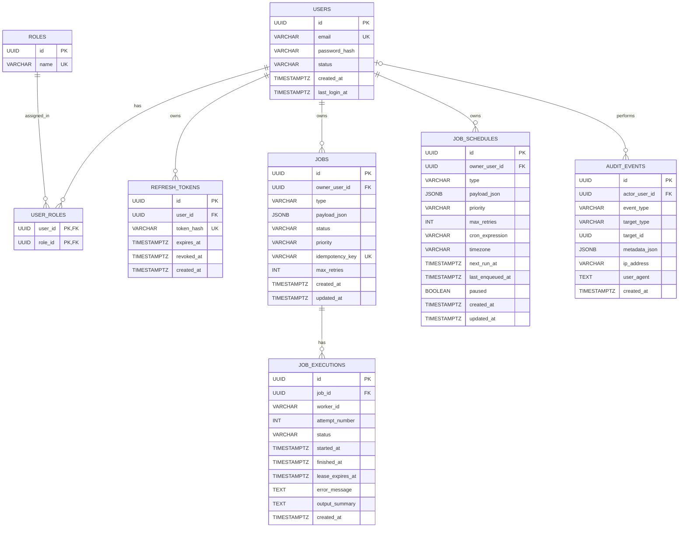

# ControlPlane ERD

## Notes

- `USER_ROLES` is the join table for the many-to-many relationship between `USERS` and `ROLES`.
- `REFRESH_TOKENS`, `JOBS`, and `JOB_SCHEDULES` all belong to a user.
- `JOB_EXECUTIONS` stores per-attempt execution history for a job.
- `AUDIT_EVENTS.actor_user_id` is nullable, so an audit event may exist even if the actor is later removed or unavailable.
- `JOBS` and `JOB_SCHEDULES` are intentionally separate:
  - `JOBS` represent concrete units of work
  - `JOB_SCHEDULES` represent recurring templates that enqueue jobs over time
