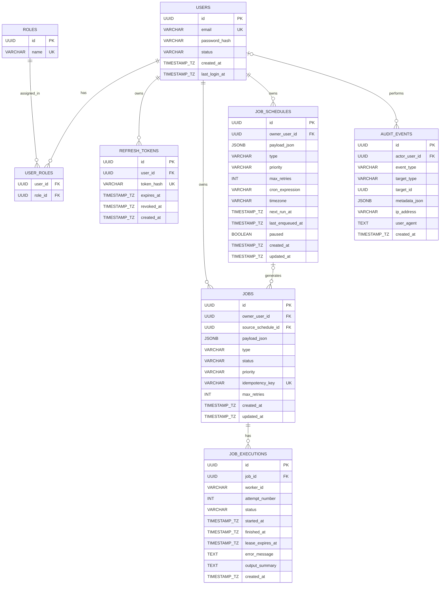

# ControlPlane ERD

> Note: Mermaid ER diagrams use `PK`, `FK`, and `UK` as key markers.
> - `PK` = primary key
> - `FK` = foreign key
> - `UK` = unique key

## Notes

- `USER_ROLES` is the join table for the many-to-many relationship between `USERS` and `ROLES`.
- `USER_ROLES` has a composite primary key of `(user_id, role_id)`.
- `REFRESH_TOKENS`, `JOBS`, and `JOB_SCHEDULES` all belong to a user.
- `JOBS.source_schedule_id` is nullable:
  - `NULL` means the job was created manually
  - a value means the job was generated from a recurring schedule
- `JOB_EXECUTIONS` stores per-attempt execution history for a job.
- `AUDIT_EVENTS.actor_user_id` is nullable, so an audit event may exist even if the actor is later removed or unavailable.
- `JOBS` and `JOB_SCHEDULES` are intentionally separate:
  - `JOBS` represent concrete units of work
  - `JOB_SCHEDULES` represent recurring templates that enqueue jobs over time
